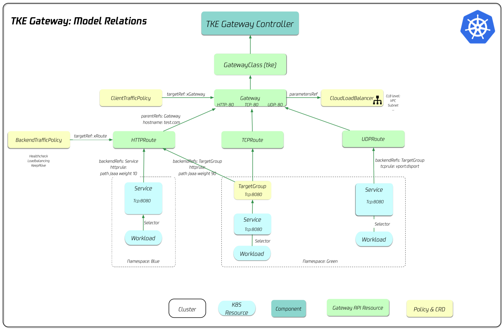

# TKE Application Gateway

     

TKE Application Gateway is an implementation of the Kubernetes [Gateway API](https://gateway-api.sigs.k8s.io/). This project is designed to run in a Kubernetes cluster and orchestrates TKE/CLB resources using Kubernetes Custom Resource Definitions like Gateway and HTTPRoute.

## Documentation

     

## Community

### Code of conduct

Participation in the community is governed by the
[Code of Conduct](code_of_conduct.md).

### Contribution

See [CONTRIBUTING](CONTRIBUTING.md) for more information.

## License

This project is licensed under the Apache-2.0 License.
